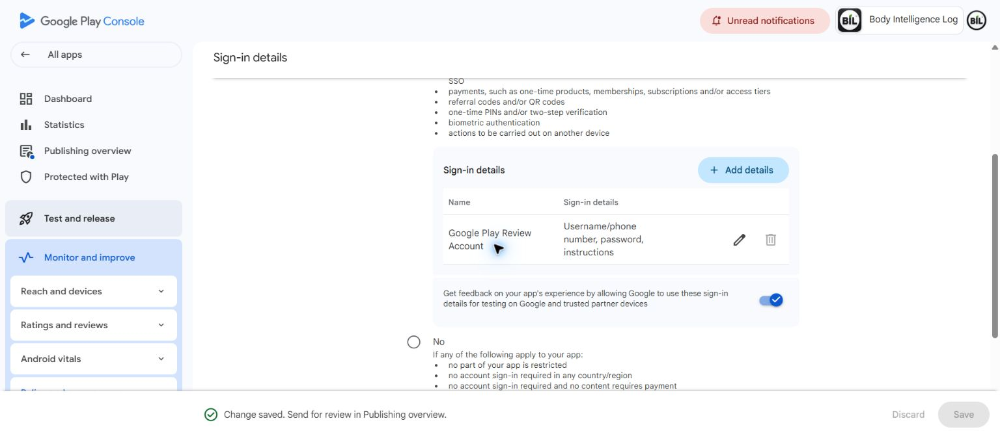

# BIL current-consent and collaborator boundary repairs

Latest superseding evidence: [final incremental closeout](BIL_PREBUILD_INCREMENTAL_CLOSEOUT_2026-10-04.md).
Exact-source QA on `3f0085e6` is SUCCESS; all five forward SQL repairs are
permanently applied, with 17 exact stored-literal comparisons and 160 scoped
Production assertions followed by unconditional rollback/independent zero
residue. The local/pre-application statuses below are historical checkpoints,
not the current deployment result. The release verdict remains NOT READY.

This is an incremental checkpoint after `8e804b7f`, not a release certificate.
The protected release branch remains `555496ebb6d6d3952c9e69e7bb6b9788269b39fa`.
Android 31 and iOS 34 frozen manifests and all native build/upload workflows
are unchanged. No app build or store submission is authorized or performed.

## Confirmed defects and bounded repairs

| Finding | Before evidence | Repair and current evidence |
| --- | --- | --- |
| BLOCKER: accepted collaborator identity ignores later privacy/block/suspension | Genuine unchanged live SQL definitions, actual metadata setter, human moderator approval and collaborator accept/idempotency; nine current-visibility cases fail under ordinary authenticated role | Projection only now uses current profile visibility, with legitimate self/moderator exceptions. Local PG17: 40 strict assertions, original RPC identity/owner/ACL/search_path preserved, zero fixture rows after rollback. Production deployment remains gated on new exact-SHA QA |
| BLOCKER: cloud RPC/direct reads ignore declined or absent cloud-sync consent | Genuine current source in local PG17 accepts absent/latest-denied writes, returns health envelopes through the RPC and direct owner SELECT | Exact latest purpose receipt must grant current policy 1; refusal wins timestamp ties. Same owner lock serializes sync/grant/revoke; restrictive SELECT policies preserve owner RLS and existing grants. Local PG17: 36 strict base assertions and five genuine two-session races pass; Production deployment remains gated |
| HIGH: old current-policy grant hides newer refusal in runtime/settings | Three actual host-gate tests fail before repair; grant/version filters select old approval instead of latest denial/unknown-policy/tied denial | Actual runtime and consent repository fetch deterministic latest receipt, validate current policy and recheck session ownership. Seven focused host/source assertions pass, including current grant/revoke, network failure and logout during read. Host HTTP/Auth are fixtures, not Production/native proof |
| MEDIUM: five unfiltered auth-user FK lookups lack coverage | Current catalog and ordinary equality EXPLAIN show partial indexes do not cover all FK rows; five different IS NOT NULL partials do cover equality | Five nonunique full BTrees, bounded locks/timeouts and strict drift guards. Local PG17 proves exact coverage/index capability, three drift/replay failures and unchanged constraints/RLS/ACLs/original indexes. No measured latency or speedup claim |
| BLOCKER: later-completed cross-version AI refusal is stamped before the grant | Genuine ordinary-role transactions reproduce transaction-start `now()` misordering for Remote AI policy 2 versus 3 and Meal Vision policy 0 versus 1; the actual unchanged Coach helper still permits the request after refusal | Separate forward-only writer repair serializes one AI purpose/owner and stamps after waiting. Local PG17: 19 scoped checks, including two BEFORE failures and three AFTER overlapping-session cases. Exact readers, Edge functions, cloud lock branch, ACLs and policies unchanged. Production deployment remains gated |
| LOW: moderator hidden-post list accepts an unbounded NULL limit | Exact unchanged Production definition in isolated PG17 returns 125 qualifying rows for an ordinary approved moderator passing NULL, versus 100 for explicit 100; nonmoderator remains denied | Forward predicate-only NULL rejection retains default 100, authority-first denial, filters, ordering, owner, ACL and search path. 25 isolated checks and independent source peer review pass. This is not moderation-write, native or Production execution proof; deployment remains gated |

The first host repair run caught an actual ordering mistake: PostgREST's
default `.order('granted')` was descending. The implementation now explicitly
uses `ascending: true`; the strict test was not relaxed. Two old source-string
contracts were updated only after real behavior demonstrated why grant-only
selection was wrong and current-policy projection was necessary. Existing
owner, transport, quota, performance and architecture requirements remain.

Permanent Candidate QA adds the three independent empty-loopback PostgreSQL
fixtures to its existing job. No temporary probe workflow, direct API table
grant, test exclusion, size limit or performance timeout was added/increased.
The unmodified prior green runs are retained; they do not certify these changes.
An additional permanent empty-loopback fixture covers the newly confirmed AI
receipt-ordering defect. A deterministic timestamp-tie bypass was not proved;
that hypothesis is not reported as a failure. The repair does not cancel a
provider request already admitted and does not change unknown store declarations.
The final narrowly scoped SQL fixture covers the reproduced hidden-list NULL
defect. Two initial harness errors concerned whitespace/rendering fingerprints;
database-computed hashes now preserve exact source bytes and the single approved
predicate delta. No production query, permission or behavioral assertion was
weakened. No additional speculative repairs are included.

Local validation with the repository's Flutter 3.44.6 / Dart 3.12.2 is complete:
2411 Dart files formatted with zero changes; full `flutter analyze --no-pub`
reports **No issues found**. These are local source checks, not native purchase,
physical-device, production migration, or exact-new-commit CI proof.

## Google reviewer metadata saved, not submitted

The owner explicitly approved saving the new Google review account's existing
private credentials to Google Play Console > App access. The normal Production
password login and authenticated owner/server entitlement/AI-credit preflight
at 17:02 UTC passed for `c1b11121-18eb-444c-aaea-b78e05bdfcc9`.
This is the legitimate administrator-provisioned review access contract, not
a fake store transaction, secret route bypass or inferred paid entitlement.
At 17:34 UTC, genuine password login and a synthetic, empty-context request to
the current Production AI Coach returned HTTP 403 `ai_consent_required`.
Authoritative usage/credits were unchanged; no consent was written and the
current test session was signed out. This proves that specific actual Edge
refusal, not a consented provider response, native route unlock or purchase.

Console entry `Google Play Review Account` was updated with the approved pair
and 420-character English instructions. Google displayed **Change saved. Send
for review in Publishing overview.** No review submission was made. The reopened
form displayed 41 username and 44 password characters and retained the exact
instructions. Sensitive DOM values are masked by the read-only browser scope,
so a byte-for-byte password readback is not claimed. The closed-page screenshot
contains no email, password, token, private key or user health data:

Existing reviewer/account-feedback selections were not changed. Apple reviewer
identity, credentials and store build attachment were not changed. This saved
metadata and server preflight do not prove every route in the Play-delivered
binary or a genuine native purchase/restore flow.

## Remaining independent release decisions

[The finite 23-RPC source review](BIL_PREBUILD_AI_CLOUD_DIARY_RPC_SOURCE_REVIEW_2026-10-04.json)
records exact source boundaries, current deployed Coach/Vision consent and
usage chains, and unresolved dependencies without inventing behavioral PASS.
Its earlier cloud-consent gap is the before-state repaired by this checkpoint,
not evidence that a still-unapplied migration is already in Production.

Paid Gemini project/endpoint identity does not establish project-specific
processing terms or retention. Express is documented as Preview; Google Cloud
service terms section 5(d) requires an applicable written/documentation exception
for Pre-GA personal-data/CDPA coverage. No BIL-specific exception or signed
agreement is evidenced. This remains HIGH legal/privacy clearance GAP, not
an invented finding that a legal violation already occurred.
[Express documentation](https://docs.cloud.google.com/gemini-enterprise-agent-platform/models/start/express-mode/overview),
[Google Cloud service terms](https://cloud.google.com/terms/service-terms).

Actual project logging/abuse-monitoring/caching configuration remains unverified;
do not claim zero retained data or an ephemeral processing exemption.
[Google retention documentation](https://docs.cloud.google.com/gemini-enterprise-agent-platform/resources/zero-data-retention).

Native StoreKit/Google Play purchase, restore and changed-binary reviewer-route
evidence remain BLOCKER gaps. Original reference images IMG_9451–IMG_9472 are
unavailable, so strict reference parity is not certified. Store privacy/tracking
answers with unknown provider/runtime facts are not manufactured; the existing
field-level disclosure reconciliation remains partial. No owner's legal
signature is fabricated. Final verdict remains **NOT READY FOR BUILD** until
all release-critical boundaries have actual evidence.
